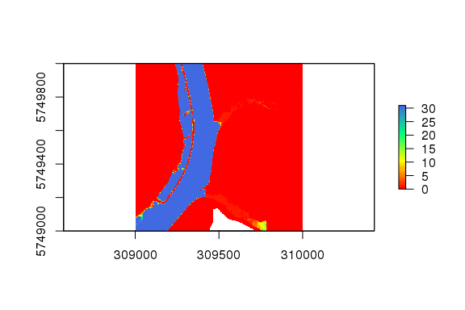

<!-- README.md is generated from README.Rmd. Please edit that file -->
hydflood3
=========

[](https://git.aqualogy.de/arnd/hydflood3/commits/master)

The R package **hydflood3** is designed to compute flood extent and duration along German federal waterways Elbe and Rhine.

Installation
------------

**hydflood3** is not currently available from CRAN, but you can install the development version from BfG's gitbucket server with:

``` r
install.packages("devtools")
library(devtools)
devtools::install_git("git://git.aqualogy.de/arnd/hydflood3.git")
```

Usage
-----

The package **hydflood3** is build around the packages `raster` and `hyd1d`.

``` r
# load the package
library(sp)
library(raster)
library(rgdal)
library(rgeos)
library(hyd1d)
library(hydflood3)

# import the raster data and create a raster stack
x <- hydRasterStack(filename_dem = "data-raw/raster.dem.tif",
                    filename_csa = "data-raw/raster.csa.tif")

# create a temporal sequence
seq <- seq(as.Date("2016-12-01"), as.Date("2016-12-31"), by = "day")

# compute a flood duration
fd <- flood3(x = x, seq = seq)

# and plot it
plot(fd)
```


