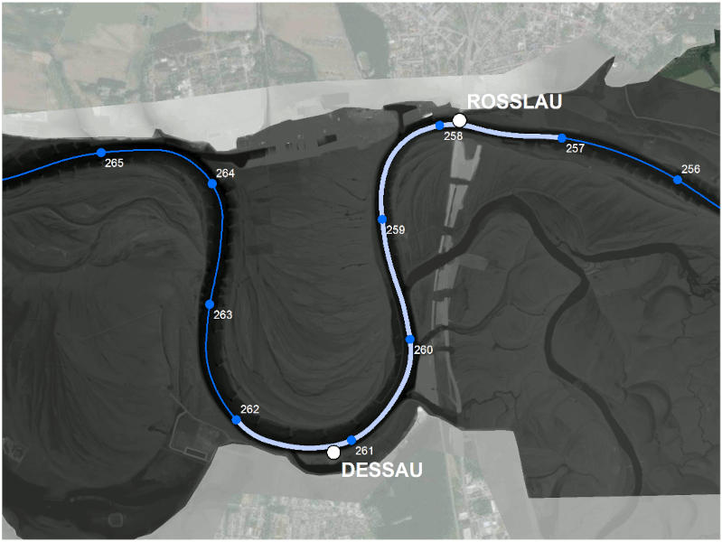
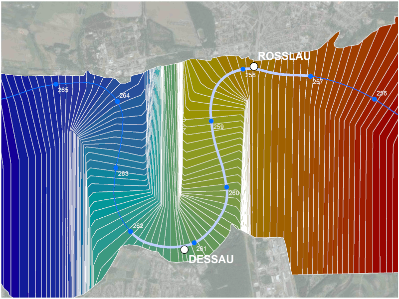

```{r setup, include = FALSE}
knitr::opts_chunk$set(
    collapse = TRUE,
    comment = "#>",
    fig.align="center",
    fig.width = 7,
    fig.height = 4, 
    root.dir = "vignettes"
)

base_hyd1d <- "https://hyd1d.bafg.de/"
```

<!-- Indent in html version TOC
     obtained from: 
     https://stackoverflow.com/questions/46201753/rmarkdown-indentation-of-toc-items-in-html-output
     -->

<script>
$(document).ready(function() {
  $items = $('div#TOC li');
  $items.each(function(idx) {
    num_ul = $(this).parentsUntil('#TOC').length;
    $(this).css({'padding-left': num_ul * 5px, 'box-shadow': none});
  });

});
</script>

<!-- numbering for figures and tables-->

```{r captions, echo = FALSE, error = FALSE, warning = FALSE, message = FALSE, include = FALSE}
# set english locale to produce english plot labels
Sys.setlocale(category = "LC_ALL", locale = "en_US.utf8")

# standard library path for the installed local packages
library(hyd1d)
library(hydflood)
library(stringr)

# Determine the output format of the document
outputFormat <- knitr::opts_knit$get("rmarkdown.pandoc.to")
if (outputFormat == "html") {
    is_html <- TRUE
} else {
    is_html <- FALSE
}

# Figure and Table Caption Numbering, for HTML do it manually
capTabNo <- 1
capFigNo <- 1

# Function to add the Table Number
capTab <- function(x){
    if(outputFormat == 'html'){
        x <- paste0("**Tab. ", capTabNo, "**: ", x)
        capTabNo <<- capTabNo + 1
    } else if (outputFormat == 'latex'){
        y <- str_replace_all(x, '(^.*)(\\[.*\\])(\\(.*\\))(.*$)', 
                             '\\1\\\\href{\\3}{\\2}\\4')
        y <- gsub("{(", "{", y, fixed = TRUE, useBytes = TRUE)
        y <- gsub("{[", "{", y, fixed = TRUE, useBytes = TRUE)
        y <- gsub(")}", "}", y, fixed = TRUE, useBytes = TRUE)
        y <- gsub("]}", "}", y, fixed = TRUE, useBytes = TRUE)
        x <- gsub("_", "\\_", y, fixed = TRUE, useBytes = TRUE)
    }
    return(x)
}

# Function to add the Figure Number
capFig <- function(x){
    if(outputFormat == 'html'){
        x <- paste0("**Fig. ", capFigNo, "**: ", x)
        capFigNo <<- capFigNo + 1
    } else if (outputFormat == 'latex'){
        y <- str_replace_all(x, '(^.*)(\\[.*\\])(\\(.*\\))(.*$)', 
                             '\\1\\\\href{\\3}{\\2}\\4')
        y <- gsub("{(", "{", y, fixed = TRUE, useBytes = TRUE)
        y <- gsub("{[", "{", y, fixed = TRUE, useBytes = TRUE)
        y <- gsub(")}", "}", y, fixed = TRUE, useBytes = TRUE)
        y <- gsub("]}", "}", y, fixed = TRUE, useBytes = TRUE)
        x <- gsub("_", "\\_", y, fixed = TRUE, useBytes = TRUE)
    }
    return(x)
}

href <- function(x, y) {
    if (outputFormat == 'html') {
        x <- paste0("[", x, "](", y, ")")
    } else if (outputFormat == 'latex') {
        x <- paste0("\\href{", y, "}{", x, "}")
    }
    return(x)
}

bf <- function(x) {
    if (outputFormat == 'html') {
        x <- paste0("**", x, "**")
    } else if (outputFormat == 'latex') {
        x <- paste0("\\textbf{", x, "}")
    }
    return(x)
}
```

<BR>

# Purpose

**hydflood** is an R package designed to compute flood extent and duration 
along the German federal waterways Elbe and Rhine.

<BR>

# Use

## Installation

The package **hydflood** is currently not available from CRAN. To install 
the recent developmental version from the Github execute the following commands:

```{r install_git, eval = FALSE}
install.packages("devtools")
library(devtools)
devtools::install_github("bafg-bund/hydflood")
```

Afterwards **hydflood** can be loaded like every other R package with the 
following command: 

```{r library_print, eval = FALSE, echo = TRUE}
library(hydflood)
```

## Dependencies

The package **hydflood** is built around the packages
[`terra`](https://cran.r-project.org/package=terra) and
[`hyd1d`](`r paste0(base_hyd1d)`). [`hyd1d`](`r paste0(base_hyd1d)`) internally
provides gauging data for all gauging stations along the rivers Rhine and Elbe
operated by the German Waterway and Shipping Administration and computes 1D water
levels. The package [`terra`](https://cran.r-project.org/package=terra)
provides the S4 class `SpatRaster` and thereby enables the GIS based comparison
between extrapolated water levels and elevation data.

```{r figure_dem, fig.show = 'asis', fig.cap = capFig("Digital elevation model of the waterway (DEM-W, in German: Digitales Geländemodell des Wasserlaufs, DGM-W) with 1 m spatial resolution at the River Elbe near Rosslau and Dessau."), echo = FALSE, error = FALSE, warning = FALSE, message = FALSE, fig.show = 'asis', out.width = "95%", fig.pos="H", fig.align = "center"}

```

**hydflood** provides download facilities for the digital elevation
models of the waterways Rhine and Elbe (DEM, @weber_dgms_2020) with 1 m spatial
resolution for chosen extents. If necessary, alternative `dem`'s can be supplied
by users. They just need to overlap with active floodplains of either the Rhine
([`sf.afr`](reference/sf.afr.html)) or the Elbe ([`sf.afe`](reference/sf.afe.html)).

To create a water surface raster, which can be compared to the `dem`, a simple
1D to 2D conversion is applied to water level data computed along the river axis
with the package [`hyd1d`](`r paste0(base_hyd1d)`). Therefore
so called cross section areas (`csa`) are needed. They originate from cross
sections used for the SOBEK models run for and incorporated into
[FLYS](https://www.bafg.de/DE/08_Ref/M2/03_Fliessgewmod/01_FLYS/flys_node.html).

```{r figure_cs, fig.show = 'asis', fig.cap = capFig("Cross sections produced to gather input data for SOBEK models used in [FLYS](https://www.bafg.de/DE/08_Ref/M2/03_Fliessgewmod/01_FLYS/flys_node.html) at the River Elbe near Rosslau and Dessau."), echo = FALSE, error = FALSE, warning = FALSE, message = FALSE, fig.show = 'asis', out.width = "95%", fig.pos="H", fig.align = "center"}

```

```{r figure_csa, fig.show = 'asis', fig.cap = capFig("Cross section areas derived from the cross sections illustrated in Fig. 2 at the River Elbe near Rosslau and Dessau."), echo = FALSE, error = FALSE, warning = FALSE, message = FALSE, fig.show = 'asis', out.width = "95%", fig.pos="H", fig.align = "center"}

```

```{r figure_csacs, fig.show = 'asis', fig.cap = capFig("Cross section areas illustrated in Fig. 3 overlaid by the corresponding cross sections illustrated in Fig. 2 at the River Elbe near Rosslau and Dessau."), echo = FALSE, error = FALSE, warning = FALSE, message = FALSE, fig.show = 'asis', out.width = "95%", fig.pos="H", fig.align = "center"}

```

These cross sections, one for each individual river station, represent water 
level isolines perpendicular to the rivers axis. To enable the spatial 
extrapolation of water level information for each river station, they were
converted to cross section areas (`csa`) which are similar to stairs along the 
river axis, each step corresponding to a station of the 1D
[`WaterLevelDataFrame`](`r paste0(base_hyd1d, "reference/WaterLevelDataFrame-class.html")`)
computed by the
[`waterLevel`](`r paste0(base_hyd1d, "reference/waterLevel.html")`)
function of package [`hyd1d`](`r paste0(base_hyd1d)`). To 
accelerate the computations, while keeping the package size on 
[CRAN](https://cran.r-project.org/) small, cross section areas are downloaded 
once for each river by package internal facilities during their first use. 

## Computation of flood extents and durations

The actual computation of a flood extent in a selected computational domain for 
a given time can be split into five steps:

1. Extraction of relevant stations within the computational domain
2. Creation of a [`WaterLevelDataFrame`](`r paste0(base_hyd1d, "reference/WaterLevelDataFrame-class.html")`) for the selected river section
3. Computation of the 1D water level using the [`waterLevel`](`r paste0(base_hyd1d, "reference/waterLevel.html")`) function of package [`hyd1d`](`r paste0(base_hyd1d)`)
4. Transfer of the 1D water level information from the [`WaterLevelDataFrame`](`r paste0(base_hyd1d, "reference/WaterLevelDataFrame-class.html")`) to the cross section areas (`csa`) through the join field `station_int`
5. Computation of a binary flood raster `fd` through the equation `fd[csa > dem] = fd[csa > dem] + 1`

To compute flood durations these five steps are repeated for every given 
time step, so that the resulting raster contains counts of how often each 
individual raster cell was flooded. The possible range of values is between 0
and the number of time steps given.

## Usage

To initialize such a `SpatRaster` several possibilities are implemented in 
the initializing homonymous function `hydSpatRaster`. Either you
provide a digital elevation model and cross section areas yourself as variables
`filename_dem` and `filename_csa` or you provide only one of them or you simply 
provide `ext` (an object of type `SpatExtent`) and `crs` (an object of class `CRS`).
Depending on the supplied coordinate reference system (supplied through either
`filename_dem`, `filename_csa` or `crs`) the respective river is selected: For
the River Rhine data with 'ETRS 1989 UTM 32N' (EPSG
[25832](https://spatialreference.org/ref/epsg/25832/)) have to be supplied, for
the River Elbe 'ETRS 1989 UTM 32N' (EPSG
[25833](https://spatialreference.org/ref/epsg/25833/)). If you can't provide
dem and csa yourself, `hydflood` provides csa data internally and downloads
the official digital elevation models of the German Waterway and Shipping
Administration with 1 m spatial resolution. Therefore you definitely need internet
access and, due to the data volume of the elevation data, your internet should 
be fast or you should be patient.

```{r init, eval = FALSE, error = FALSE, warning = FALSE, message = FALSE}
# import the raster data and create a raster stack
x <- hydSpatRaster(filename_dem = "data-raw/raster.dem.tif",
                   filename_csa = "data-raw/raster.csa.tif")
```

After initialinzig an object of type `hydSpatRaster` everything else is 
straight forward. Create a temporal sequence `seq`:

```{r seq, eval = FALSE, error = FALSE, warning = FALSE, message = FALSE}
seq <- seq(as.Date("2016-12-01"), as.Date("2016-12-31"), by = "day")
```

And supply both of them to the `flood3` function, which will do the computation
and return an 'INT4S' raster with counts of how often the individual cell of the
`dem` was lower than the `csa` during the temporal sequence. For each time step
of the temporal sequence the corresponding 1D `WaterLevelDataFrame` is computed,
joined to `csa` through the `station_int` column and compared to the `dem` so 
that the possible values of the returned product range between 0 and 
`length(seq)`:

```{r usage, eval = FALSE, error = FALSE, warning = FALSE, message = FALSE}
# compute a flood duration
fd <- flood3(x = x, seq = seq)

# and plot it
plot(fd)
```

<BR>

# Products

## Raster data

Raster data with annual flood durations between 1960 and 2021 for the active 
floodplains of the River Rhine and the River Elbe have been submitted to and
published on [pangaea.de](https://www.pangaea.de) [@weber_flood3data_2022].

<BR>

## ShinyApps

<BR>

### flood3daily

The [`flood3`](reference/flood3.html) function is the central function of the package
**hydflood**. With the help of this function daily flood extents are computed
for a number of areas along the River Elbe. These products are visualized
through a shiny web application available through:

\begin{center}
\url{https://shiny.bafg.de/flood3daily/}
\end{center}

``` {r link_flood3daily, eval = is_html, echo = FALSE, results = 'asis'}
cat('<p style="text-align: center;"><a href="https://shiny.bafg.de/flood3daily" target="_blank">https://shiny.bafg.de/flood3daily/</a></p>')
```

```{r figure1, echo = FALSE, fig.cap = capFig(paste0("Screenshot of the ", href("flood3daily-ShinyApp", "https://shiny.bafg.de/flood3daily/"), " with the modelled flood extent computed for 2016-12-21 at the River Elbe between Rosslau and Dessau, Germany.")), fig.show = 'asis', out.width = "100%"}
knitr::include_graphics('screenshot_flood3daily.png')
```

<BR>

## flood3wms

The [`flood3`](reference/flood3.html) function is the central function of the package
**hydflood**. With the help of this function annual flood durations between 1990
and 2021 have been computed for the active floodplains of the River Rhine and
the River Elbe. These large scale raster products have been visualized as web
map services and are available through a shiny web application:

\begin{center}
\url{https://shiny.bafg.de/flood3wms/}
\end{center}

``` {r link_waterlevelpegelonline, eval = is_html, echo = FALSE, results = 'asis'}
cat('<p style="text-align: center;"><a href="https://shiny.bafg.de/flood3wms/" target="_blank">https://shiny.bafg.de/flood3wms/</a></p>')
```

```{r figure2, echo = FALSE, fig.cap = capFig(paste0("Screenshot of the ", href("flood3wms-ShinyApp", "https://shiny.bafg.de/flood3wms/"), " with the annual flood duration of 2016 at the River Elbe between Rosslau and Dessau, Germany.")), fig.show = 'asis', out.width = "100%"}

```

<BR>

---
nocite: |
  @weber_hyd1d_2022
...

# References

